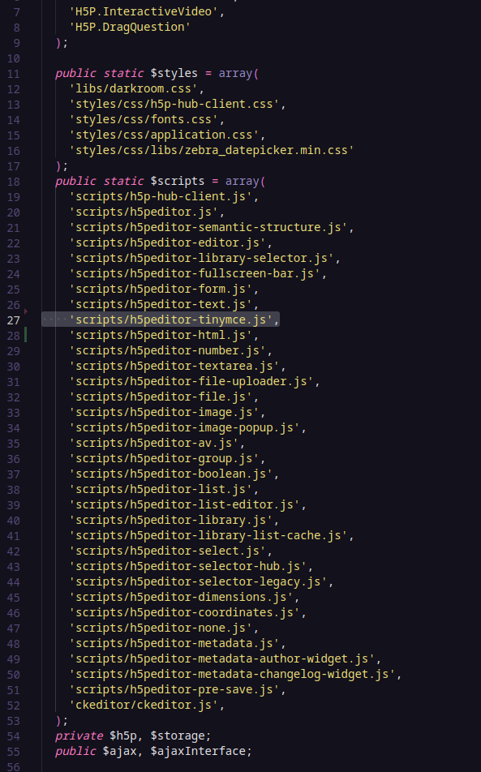
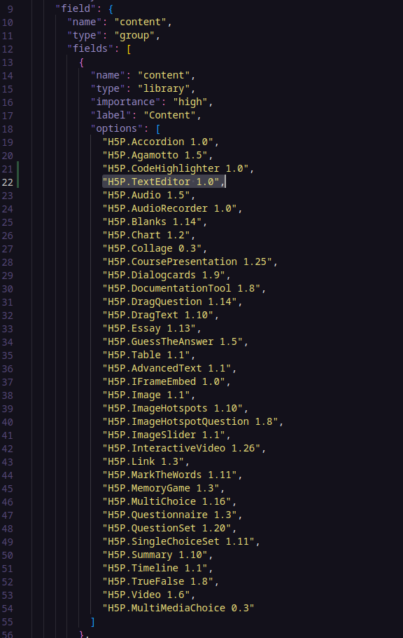

# Readme - TextEditor

Esta é uma ferramenta H5P de edição de conteúdo de texto baseada na biblioteca TinyMCE. Com este editor de texto enriquecido, você pode criar conteúdo formatado de maneira simples e intuitiva, graças a uma interface fácil de usar.

**Como Integrar Esta Biblioteca no Seu Ambiente:**

1. Não será necessário se preocupar em instalar pré-dependências, pois essa nova ferramenta depende apenas do H5P.Text. Por padrão, esse componente já estará instalado em seu ambiente.

**Utilizando o componente TextEditor dentro de outro conteúdo h5p:**

1. Digamos que você queira utilizar o TextEditor dentro de um conteúdo Column, que inclusive o Livro Interativo utiliza o Column para criar seus conteúdos. Por padrão o Column nao irá mostrar como opção o nosso textEditor.
2. Então teremos que inicialmente baixar a biblioteca Column localmente, para fazer a alteração. Podemos adquiri-la por linha de comando utilizando a interface de linha de comando do H5P (h5pcli). Mais informações em: https://h5p.org/h5p-cli-guide

   1. baixando o column: Abra um terminal localmente e insira o seguinte comando: `h5p get h5p-column`
   2. Abra o column em algum editor de código(VS Code)
   3. Inserindo nosso componente: No arquivo semantics, devemos inserir `"H5P.TextEditor 1.0",`, dessa forma o nosso TextEditor será listado como uma opção.
   4. Por fim, devemos empacotar o diretório do Column utilizando a linha de comando: `h5p pack h5p-column h5p-column.h5p`.
   5. Agora basta inserir o arquivo h5p-column.h5p no seu ambiente para atualizar, e usufruir do novo componente de texto.

Se tiver mais alguma dúvida ou precisar de assistência adicional, por favor, não hesite em perguntar.
