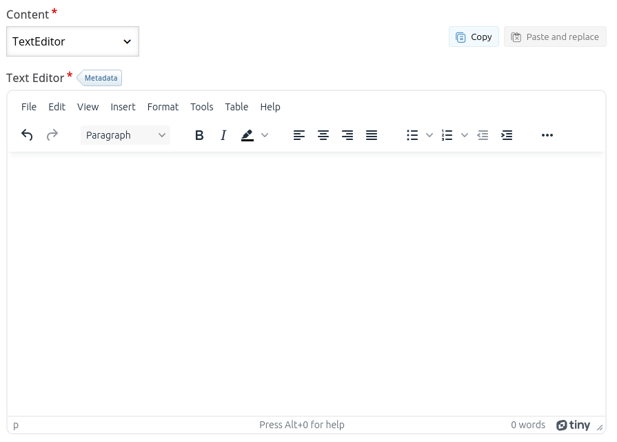

# Readme - TextEditor

This is an H5P tool for text content editing based on the TinyMCE library. With this rich text editor, you can create formatted content in a simple and intuitive way, thanks to an easy-to-use interface.

**How to Integrate This Library into Your Environment:**

1. You won't need to worry about installing pre-dependencies, as this new tool relies solely on H5P.Text. By default, this component will already be installed in your environment. If it isn't, please access: [H5P.Text](https://github.com/cte-zl-ifrn/H5P.PreDependencias/releases/download/1.0.0/text.h5p)
2. So just download the textEditor file from the release, and insert the packaged file into your development environment. Visit: [Text Editor](https://github.com/cte-zl-ifrn/H5P.TextEditor/releases/download/1.0.2/texteditor.h5p)

**Using the TextEditor component within another h5p content:**

1. Let's say you want to use the TextEditor within a Column content, which the Interactive Book also uses the Column to create its contents. By default, Column will not show our TextEditor as an option.
2. Para isto, basta baixar o arquivo h5p do column em: [column](https://github.com/cte-zl-ifrn/H5P.PreDependencias/releases/download/1.0.0/column.h5p) e inserir o arquivo compactado no seu ambiente.
      
**Step-by-Step Guide to Compress and Integrate H5P Libraries in Moodle:**

This guide provides detailed instructions on how to compress a library for the H5P extension and integrate it into Moodle. Make sure to follow each step carefully to ensure a successful installation.

1. **Installation of H5P CLI:** Use the command to install the H5P CLI globally: `npm install -g h5p` 
2. **Navigate to the Library Folder:** Access the desired library folder using the command, e.g.: `cd h5p-column` 
3. **Compressing the Library into .h5p:** Execute the following command to compress the folder into an .h5p file: `h5p pack h5p-column`
4. **Access Moodle:** Open Moodle and access the Site Administration section.
5. **H5P Content Type Management:** Navigate to "H5P" and select "Manage H5P Content Types."
6. **Upload the Compressed Library:** In the "Upload H5P Content Types" area, upload the newly created .h5p file.
7. **Confirmation Message:** A success message will be displayed, confirming the successful integration of the library.

Note: Some contents may error out because they have pre-dependencies. If you try to upload this content before uploading its dependencies, an error message will be presented. So upload the pre-dependencies first.

If you have any further questions or need additional assistance, please don't hesitate to ask.
